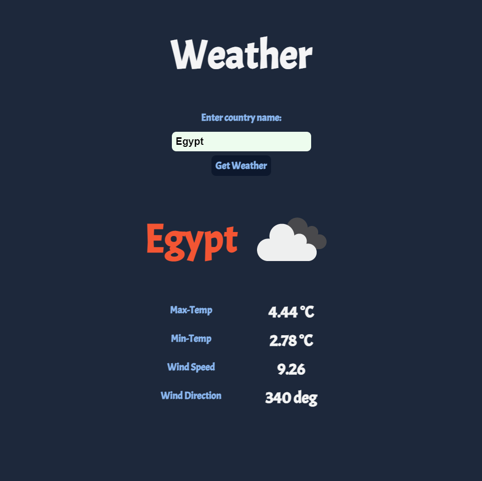

# WEATHER APP

This project is a weather application that allows users get the current weather for any country by just entering its name. It's based on the OpenWeatherMap API and built mainly by JavaScript.

In this project:

- Made a connection with the weather API.
- Made a styled homepage for displaying weather information.
- Made JavaScript logic that handles displaying info.
- Handled the error when we have invalid country name.

## Live Demo

[LIVE!](https://mohamed-js.github.io/RESTAURANT/)

## Usage

- Clone the repo "https://github.com/Mohamed-js/restaurant.git".
- run "npm install"

## Technologies

- JavaScript
- CSS
- Webpack
- VSCode

## Author

👤 **Mohammed Atef**

- GitHub: [@Mohamed-Atef](https://github.com/Mohamed-js)
- Twitter: [@Mohammed_Atef](https://twitter.com/Demovejetta)
- LinkedIn: [LinkedIn](https://www.linkedin.com/in/mohamed-js/)

## 🤝 Contributing

Contributions, issues, and feature requests are welcome!

## Show your support

Give a ⭐️ if you like this project!

### Acknowledgements

- Microverse
- The Odin Project
